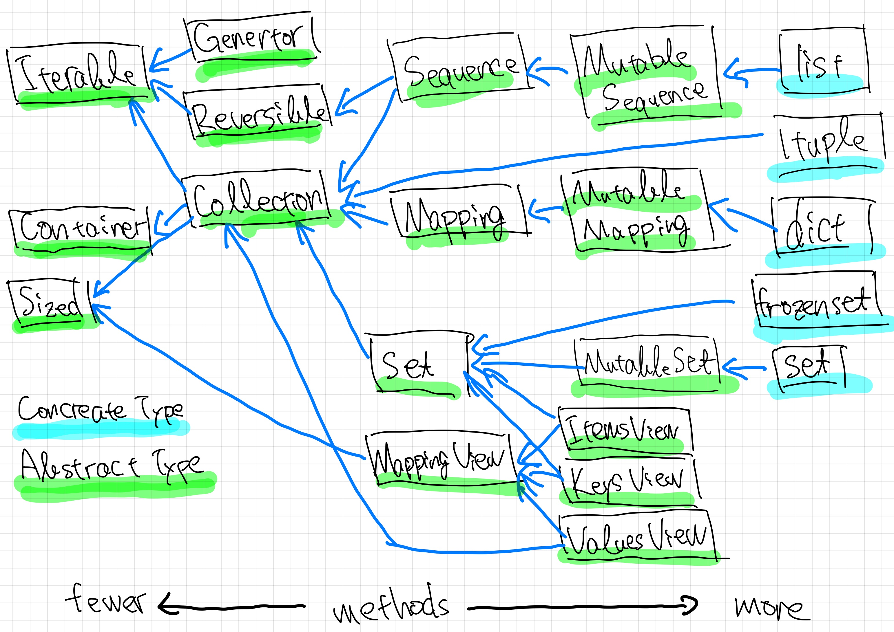

<!-- _class: title-->
<!-- _paginate: false -->

# Getting Started with Statically Typed Programming in Python 3.10

## Peacock (Yoichi Takai), at EuroPython 2021

---

<!-- _class: subtitle -->

# Preface: before the main topic...

## Self-introduction, What about I belong to

---

<!-- _class: preface -->

# Hello EuroPython!


- Nice to meet you, Please call me **Peacock**
- I'm Attending from Japan, now it's 17:30 in JST
- Thanks for considering timezone!
- Slide is uploaded [https://speakerdeck.com/peacock0803sz/europython2021](https://speakerdeck.com/peacock0803sz/europython2021)
    - You can see same via QR code
- Chat(Element): `#Conference 1: Optiver`
- PEP8 styles in the sample code are ignored, due to space limitations

---

<!-- _class: preface -->

# Self-introduction


- Name: Peacock / Yoichi Takai
    - [Twitter](https://twitter.com/peacock0803sz/) / [GitHub](https://github.com/peacock0803sz/) / [Facebook](https://www.facebook.com/peacock0803sz): `peacock0803sz`
- Company: [CMScom](https://cmscom.jp) (since 2019/09 ~)
- Activites about [PyCon JP Association](https://www.pycon.jp)
    - Staff of PyCon JP [2020](https://pycon.jp/2020), [2021](https://2021.pycon.jp)
    - [PyCon JP TV](https://tv.pycon.jp)'s director
        - YouTube live about PyCons and local events
        - Held once a month

---

<!-- _class: agenda -->

# Today's topic

1. Why I talk about typing?
2. Introduction of typing, How to write basically
3. Generics, User-Defined types
    1. Best practice included
4. Backward compatibility for 3.9 or before
5. Updates overview on 3.10

---

# Why I talk about typing?

- It's been five years since typing appeared
    - In Python 3.5, at 2015
- Several big PEPs were adopted and updated over the years
- Even now, I think many people **don't know where to start**
	- Because there is little coherent information

---

# I will not talk about

- Developing library with typing
- Configures and options of mypy
- How to use them in CI, ex: GitHub actions, Circle CI and etc...
- History of type hinting
- Implementation of typing, mypy
- Abstract Syntax Tree (AST)

---

<!-- _class: subtitle -->

# Introduction of typing
## How to write basically

---

# What makes you happy?

- It knows the type when you reference it in the editor.
- It gets angry when I try to give it the wrong one.
- The completion will work when accessing the return value of a function using dot.

---

# In code review

Reviewer can know variables or function returns types

---

# Without typing

---

# With typing

---

# Built-in types

- `bool`, `bytes`, `float`, `int`, `str`
    - you don't need to do anything to use them.
- `None`: used for functions that return nothing.

---

# Let's start with function definitions

---

# Since 3.9: Generics in standard Collections

- `dict`, `frozenset`, `list`, `set`, `tuple`
    - Collections can be written with `[]` for the type inside.
        - 3.9 and later only
        - 3.7, 3.8 write `from __future__ import annotaions` (see below)
        - 3.6: import annotations starting with uppercase letters from `typing` (next section)
    - ex: `list[str]`, `dict[str, int]`.
    - ref: [official documentation (English)](https://docs.python.org/3.9/whatsnew/3.9.html#type-hinting-generics-in-standard-collections)

---

- Until 3.8, it was from `typing`, but now it's depericated.
- For `__builtins__` start with lowercase without doing anything.
    - Such as `list`, `tuple`, and `dict` etc...

- For `collections` (ex: deque, defaultdict, ...), import modules start with `collections`
- iterable, callable, and other protocol-related items import modules start with `collections.abc`.
- regular expressions from `re`. 
- Context-related items are available in `contextlib`.

---

# Using different types of collections

- There are many types in `collections.abc`.
- It's better to use a collection with as few methods to increase portability.
- The following figure shows the relationship.
    - The further to the left you go, the fewer methods it has.
    - To the right, the more methods it has.
- It's a good idea to look at the methods used in your functions.
    - Choose the types on the left side of this diagram as much as possible.

---

# (Deprecated since 3.9) import from typing module

- For Generics, until 3.9, you had to write `from typing import ...`
    - Collection, protocol related, etc.
- From 3.9, it's deprecated because of the way of writing described before.
- However, there are some exceptions such as Any and Optional.

## todo: examples

---

<!-- _class: full-img -->

# Great inheritance tree



---

# The deferrence between tuple and others Sequences

- Tuples are fixed up to the length information
    - Specify the type for the number of elements
        - Or you can mix types, such as tuple[int, str, float]. 
- A sequence, such as a list, has the same constraint for all elements in the element
    - Can be used regardless of the length of the sequence by setting only one element.

---

# Escape: from typing import Any

- Can hold instances of any type.
- It's better not to use it.
    - Import and use from `typing` when necessary.

```py
from typing import Any

unknown_variable: Any
```

---

<!-- _class: subtitle -->

# A little more advanced: Generics type

---

# Union (Mager type)

- `Union`: merged type, can be represented by `|` since 3.10
    - You've probably seen it on haskell or typescirpt

```py
from __future__ import annotations
def square(number: int | float) -> int | float:
    return number ** 2
```

Union objects can be tested for equality with other union objects

```py
(int | str) | float == int | str | float  # Unions of unions are flattened
int | str | int == int |                  # Redundant types are removed
int | str == str | int                    # the order is ignored
int | str == typing.Union[int, str]       # Compatible with typing.Union
```

---

# Optional type

- Shorthand, `Optional[T]` is quivalent to Union with None.
    - Behaves just like Union: `T | None`
- If you use it in a function return value or something, it will propagate, so be careful how you use it.

```py
from typing import Optional
age: Optional[int]
age = 17
age = None # This is also valid
```
---

# Avoid using Optional as much as possible

- Optional is useful but causes code bloat.

```py
def get_content() -> str | None:
    r = request.get("https://example.com")
    if r.status_code ! = 200: # This is the guard (early return)
        logging.warning("HTTP response is %d!", r.status_code)
        return None
    return r.text
```

- When you use the up function, you might write another guard and return `None`.
- As a result, we need to write a guard to the previous method, which reduces readability.

---

In this case

- It would be cleaner to raise a `raise RuntimeError`.
    - The cost of raising exceptions in Python is (relatively) low
        - The performance would be fine.
- The lack of null-safe methods in Python is also a factor
    - But if there were such methods, they would be abused.
    - Null-safe means: a method that does not raise an exception when passed None.

---

# Callable (callable object)

Can be used when writing functions that take a function as an argument, such as decorator functions.

```py
from collections.abc import Callable # since 3.9
from typing import Callable # 3.8 and earlier
from fuctools import wraps
def validate(func: Callable) -> Callable[... , Callable | tuple[Response, Literal[400]]]:
    @wraps(func)
    def wrapper(*args, **kw) -> Callable | tuple[Response, Literal[400]]:
        try:
            j = request.json
            if j is None: raise BadRequest
        except BadRequest:
            return jsonify({"data": [], "errors": {"message": ERROR_MESSAGE, "code": 400}}), 400
        return func(*args, **kw)
    return wrapper
```

---

# User-defined Generic types

A generic type is typically declared by inheriting from an instantiation

Example: a generic mapping type

```py
from typing import TypeVar, Generic
KT, VT = TypeVar("KT"), TypeVar("VT")
class Mapping(Generic[KT, VT]):
    def __getitem__(self, key: KT) -> VT: pass
```

This class can then be used as:

```py
X, Y = TypeVar("X"), TypeVar("Y")
def lookup_name(mapping: Mapping[X, Y], key: X, default: Y) -> Y:
    try: return mapping[key]
    except KeyError: return default
```

---

<!-- _class: subtitle -->

# Introducing and promotion from PyCon JP

---

<!-- _class: pyconjp2020-cheers -->

# PyCon JP 2020 was held in online!


---

<!-- _class: content -->

# :mega: Announces about PyCon JP 2021 (1/2)

- Website: https://2021.pycon.jp/
- Blog: https://pyconjp.blogspot.com/
- Twitter: [@pyconjapan](https://twitter.com/pyconjapan)
- Date(conference day): 10/15(Fri), 16(Sat)
    - Sprint and Training is not determined
    - Now, CfP is over
    - In the process of review and adoption

---

<!-- _class: content -->

# :mega: Announces about PyCon JP 2021 (2/2)

- Venue: Online or Hybrid:
    - On-site venue is Bellesalle Kanda, Tokyo
    - Working on a way to hold it in a hybrid
- Call for sponsors (second) is opened: [Blog post](https://pyconjp.blogspot.com/2021/06/pycon-jp-2021-2notice-of-start-of.html)
- For the latest information, check our blog and Twitter
- Share this slide page with other Pythonistas around you!

---

<!-- _class: subtitle -->

# Updates overview & How to use new features in previous versions

---

# Recent Python updates

https://www.python.org/downloads/

| ver. | status   | release    | EOS        | PEP                                              | main new feture          |
| ---- | -------- | ---------- | ---------- | ------------------------------------------------ | ------------------------ |
| 3.10 | beta 4   | 2021-10-04 | 2025-10    | [619](https://www.python.org/dev/peps/pep-0619/) | Pattern matching         |
|  3.9 | bug fix  | 2020-10-05 | 2025-10    | [596](https://www.python.org/dev/peps/pep-0596/) | Union operators to dict  |
|  3.8 | security | 2019-10-14 | 2024-10    | [569](https://www.python.org/dev/peps/pep-0569/) | `=` in f-string          |
|  3.7 | Security | 2018-06-27 | 2023-06-27 | [537](https://www.python.org/dev/peps/pep-0537/) | Data classes             |
|  3.6 | Security | 2016-12-23 | 2021-12-23 | [494](https://www.python.org/dev/peps/pep-0494/) | Literal string (f-string) |

---

# What is the `__future__` module: (dunder future)?

- It exists for backward compatibility.
- It describes when disruptive changes are introduced and become mandatory.
- In addition to typing, it was also used to call 3.x features in 2.x.
    - ex) `print_func`, `unicode_literals` etc ...
- refs: [Official documentation](https://docs.python.org/3/library/__future__.html), [future statement](https://docs.python.org/3/reference/simple_stmts.html#future)

---

<!-- _class: subtitle -->

# New Features Related to Type Hints in 3.10

---

# PEP 604: New Type Union Operator

- The aforementioned union type can be used as an operator.
- You can also use it when asking `isinstance()`.
- More intuitive, since TypeScipt and others use this notation.

```py
int | str == typing.Union[int, str]  # Compatible with typing.Union
```

---

# PEP 612: Parameter Specification Variables

**THIS TOPIC IS DIFFICULT!!!**

## Motivation

- Tring to write a generic decorator, it's difficult to write the type
- Neeeded a way to represent a function that has the **same arguments as the specified function**

---

## Approach

- Adding an argument type called `ParameterSpecification` solves the problem.
- It can be used with `Callable` to behave like a generic callable object.
    - You can think of it as an argument version of `TypeVar`.

---

## Example

```py
from typing import Callable, ParameterSpecification, TypeVar
Ps, R = ParameterSpecification("Ps"), TypeVar("R")

def add_logging(f: Callable[Ps, R]) -> Callable[Ps, R]:
    def inner(*args: Ps.args, **kwargs: Ps.kwargs) -> R:
        log_to_database()
        return f(*args, **kwargs)
    return inner

@add_logging
def foo(x: int, y: str) -> int: return x + 7
```

---

# PEP 613: TypeAlias

## Motivation
- We consider global variables without type hints to be type aliases.
    - This tends to cause problems with forward references, scoping, etc.
    - So we're going to make it possible to explicitly define type aliases.
- You can still define type aliases implicitly.

---

## Approach

- Add a new `typing.TypeAlias`
    - Write a variable of type alias type like `T: TypeAlias = int`
- Variables defined at the global level are considered type aliases.
- Using ForwardReference, you can write `T: TypeAlias = "int"`.

## Example

```py
x = 1  # untyped global expression
x: int = 1  # typed global expression

x = int  # untyped global expression
x: Type[int] = int  # typed global expression

x: TypeAlias = int  # type alias
x: TypeAlias = “MyClass”  # type alias
```

---

# PEP 647: User-Defined Type Guards

## Motivation

Type checker tools uses a technique called type narrowing to determine the type information
In the this example, the `if` statement and `is None` are used to automatically narrow down the type

```py
  def func(val: Optional[str]):
    # "is None" type guard
    if val is not None: # Type of val is narrowed to str
        pass
    else: # Type of val is narrowed to None
        pass
```

---

However, that will not work as intended if the user function is used.

```py
  def is_str_list(val: List[object]) -> bool:
    """Determines whether all objects in the list are strings"""
    return all(isinstance(x, str) for x in val)

  def func1(val: List[object]):
    if is_str_list(val): print(" ".join(val))  # Error: invalid type
```

- `TypeGuard` allows you to define user-defined type guards via the new typing.
- By using user-defined type guards, it is easier to get support for type narrowing.

---

<!-- _class: agenda -->

# Summary

1. Let's start writing a type hint from the function definition.
2. Collections and Generics
    1. Standard collection type hints starting with lowercase (3.9)
3. Python 3.10 style type hinting
    1. Union operator `|`, Parameter Specific Variables, Explicit Type Aliases

---

# Pages I used for reference

- https://docs.python.org/3/library/typing.html
- https://docs.python.org/3.10/whatsnew/3.10.html
- http://mypy-lang.org
- https://future-architect.github.io/articles/20201223 (ja)
- https://qiita.com/tk0miya/items/931da13af292060356b9 (ja)
- https://qiita.com/tk0miya/items/1b093c2eee7668fffb62 (ja)
- https://qiita.com/tk0miya/items/a27191f5d627601930ed (ja)

---

<!-- _class: see-you -->

# We look forward to seeing you again at PyCon JP 2021!


